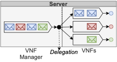

# Queue Simulation with Packet Delegation

This repository simulates the behavior of a queue using packet delegation.

## Packet Delegation



Packet delegation is a load sharing mechanism designed for Network Function Virtualization environments. A server hosts a VNF Manager (VNFM) and one or more VNFs. When receiving a packet direct to a VNF, the VNFM monitors the VNF's queue length. If it exceeds threshold `theta`, the VNFM either keeps the packet with probability `k` for the VNF to process or redirects the packet to some remote VNF with probability `1-k`.

### Relevant Papers
- Zervopoulos, A., & Oikonomou, K. (2023, June). Load balancing of virtual network functions through packet delegation. In *2023 International Balkan Conference on Communications and Networking (BalkanCom)* (pp. 1-6). IEEE.
- Zervopoulos, A., & Oikonomou, K. (2025, June). Queueing Model for Load Balancing Virtual Network Functions Through Packet Delegation. In *2025 International Balkan Conference on Communications and Networking (BalkanCom)* (pp. 1-6). IEEE.

## Prerequisites

*   **Go** (Golang): Required to run the simulation core.
*   **Python 3**: Required for the parallel execution wrapper.
    *   **tqdm**: Required for Python progress bars (`pip install tqdm`).
    *   **pandas, matplotlib, numpy, seaborn, jupyter**: Required for plotting results in `notebooks/`

## Configuration (`params.json`)

The simulation accepts a JSON configuration file. Parameters can be scalar values or arrays. If arrays are provided, the simulation will run for every combination of parameters (Cartesian product).

Example `params.json`:
```json
{
  "arrivalRate": 5.0,
  "departureRate": [8.0, 10.0],
  "N": 100000,
  "keepProbability": [0.1, 0.5, 0.9],
  "theta": 10
}
```

*   `arrivalRate`: ($\lambda$) Rate of incoming packets.
*   `departureRate`: ($\mu$) Processing rate of the queue.
*   `N`: Total number of messages to process per simulation.
*   `keepProbability`: ($k$) Probability of keeping a packet when threshold is met.
*   `theta`: ($\theta$) Queue length threshold for delegation.

## Simulation Instructions

### Single Simulation
Run a specific configuration manually:
```bash
go run go_delegation_queue.go params/params.json
```
*   **Output**: Results are saved to `csv/k=..._theta=.../events.csv`.

### Parallel Simulations

Multiple simulations can be executed in parallel for all parameter files found in the `params` folder:
```bash
python3 run_multiple.py
```
*   **Warning**: This may generate massive event log CSVs (approx. 25GB with the provided parameters).
*   Ensure the `csv` directory and the respective subdirectories exist or the script has permissions to create it.

### Plot Results

Simulation results can be plotted using the included Python notebooks:
- `notebooks/go_deleg_stats.ipynb`: plots the statistics for the delegation process
- `notebooks/go_proc_stats.ipynb`: plots the statistics for the departure process
